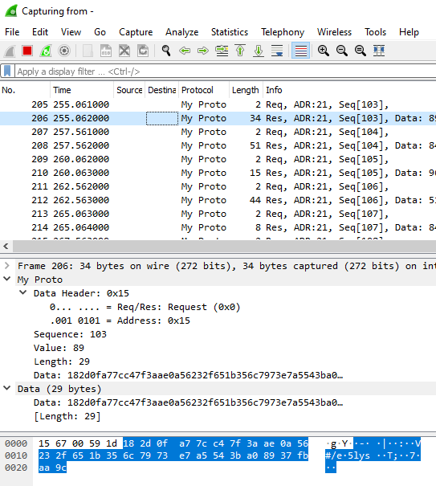

# Custom Wireshark Dissector Reference 

This repo contains an end-to-end example for generating `.pcap` data, streaming the data into wireshark, and then dissecting the custom binary data. 

- **[demo.lua](demo.lua)** is an example of a custom lua chain dissector 
- **[simulate_devices.js](simulate_devices.js)** is a nodejs script to stream binary pcap data

## Instructions:

Clone repo:

```
git clone https://github.com/NateZimmer/wireshark-dissector
cd wireshark-dissector
```

Copy `demo.lua` into Wireshark plugins folder (requires admin elevation):

```
copy demo.lua "C:\Program Files\Wireshark\plugins\"
```

Start streaming data into Wireshark: 

```
node simulate_devices.js | "C:\Program Files\Wireshark\wireshark.exe" -k -i -
```

The following demonstrates the data stream as well as the dissection: 

<p align='center'>
    
</p>

## Example Protocol:

Request (2 bytes)

```
| Packet Header, 1 Byte       | Seq, 1 Byte |  
| Bit7: IsRequest, Bit6-0: Adr| 0-255       |
```

Response (5 + n bytes)

```
| Packet Header, 1 Byte       | Seq, 1B| Val,2B| Len,1B| Rnd,LenB |
| Bit7: IsRequest, Bit6-0: Adr| 0-255  | 0-2^16| 0-255 | Rnd Data |
```


## Wireshark Tips: 

Use shortcut `cntrl+shift+f` to see file level dissection. This is help for learning the packet structure of `.pcap` as well as `.pcapng`. 

On linux, the wireshark plugins folder may be located @: 

ARM/PI:

```
/usr/lib/arm-linux-gnueabihf/wireshark/plugins
```
or Ubuntu: 

```
/usr/lib/x86_64-linux-gnu/wireshark/plugins
```